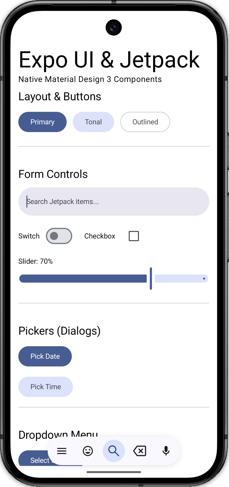
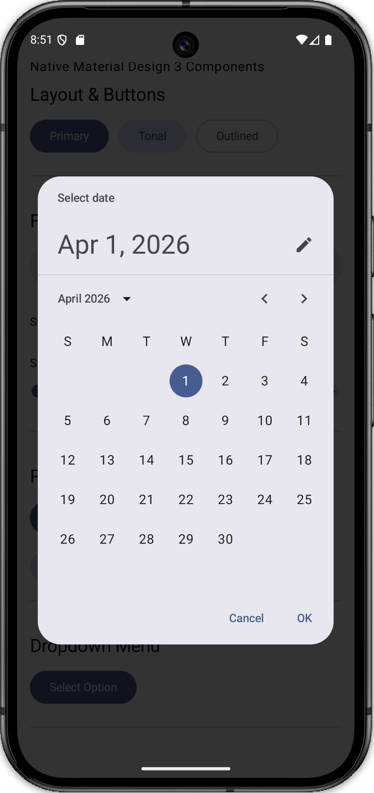
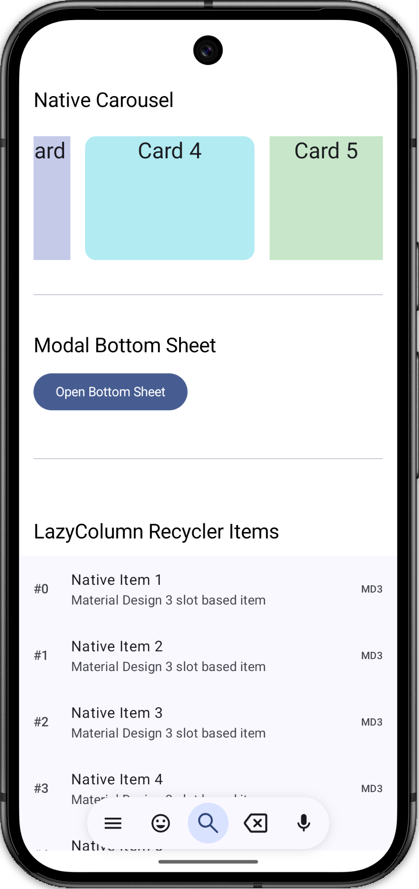
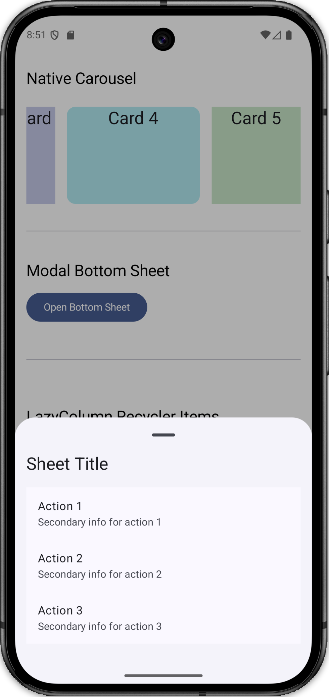

# Expo UI: Jetpack Compose (Android)

This project demonstrates the usage of `@expo/ui`, a library that brings native **Jetpack Compose** (Android) and **SwiftUI** (iOS) components directly into React Native.

## Android Native Fundamentals

### What is Jetpack?
**Android Jetpack** is a suite of libraries, tools, and guidance provided by Google to help developers build high-quality Android apps more easily. These components help you follow best practices, free you from writing boilerplate code, and simplify complex tasks, so you can focus on the code you care about. Jetpack components are designed to work across different Android versions and devices consistently.

### What is Compose?
**Jetpack Compose** is Android’s modern toolkit for building native UI. It is a **declarative** UI framework, meaning you describe your UI by calling a series of functions that transform data into a UI hierarchy. When the underlying data changes, the framework automatically re-executes these functions, updating the UI. 
- **Less Code:** It reduces the amount of code needed compared to the old XML-based View system.
- **Intuitive:** It uses Kotlin APIs that are easy to understand.
- **Accelerated Development:** It is compatible with all your existing code and easily integrates with other Jetpack libraries.

## Previews

| | |
|:---:|:---:|
|  |  |
|  |  |

## What is Expo UI?

`@expo/ui` allows developers to build truly native user interfaces using modern platform-specific frameworks while maintaining a unified React-like API. On Android, it leverages **Jetpack Compose** and **Material Design 3**.

### Key Concepts

1.  **Host**: The mandatory wrapper component that bridges the React Native view hierarchy with the native (Compose/SwiftUI) view hierarchy.
2.  **Modifiers**: A powerful layout and styling system inspired by Jetpack Compose. Instead of standard React Native `style` objects, native components use a `modifiers` prop containing an array of functions (e.g., `paddingAll(16)`, `fillMaxWidth()`).
3.  **Compound Components**: Many components use the compound pattern (e.g., `ListItem.Leading`, `SearchBar.Placeholder`) to mirror native composable slots/lambdas.

## Jetpack Compose Components Exposed

The following components are demonstrated in this project:

### Layout Components
*   **Column**: A vertical layout container, equivalent to `Column` in Jetpack Compose or `VStack` in SwiftUI.
*   **Row**: A horizontal layout container, equivalent to `Row` in Jetpack Compose or `HStack` in SwiftUI.
*   **HorizontalDivider**: A horizontal line that separates content.

### Basic Components
*   **Text**: Native Material 3 text component with support for design system typography variants.
*   **Button, FilledTonalButton, OutlinedButton**: Native Material 3 buttons with predefined styles.

### Form & Interaction
*   **Slider**: A native range selector component.
*   **Switch**: A native toggle switch.
*   **Checkbox**: A native Material 3 checkbox.
*   **SearchBar**: A fully native search bar with integrated state and placeholder support.
*   **DatePickerDialog & TimePickerDialog**: Fully native Android material dialogs for selecting dates and times.
*   **DropdownMenu**: A native Material 3 dropdown menu with anchor-based positioning.

### High-Performance Lists & Containers
*   **LazyColumn**: The Jetpack Compose equivalent of `FlatList`. It provides extremely high performance for long lists by only rendering items currently in the viewport.
*   **ListItem**: A pre-styled Material 3 list item component with Leading and Trailing slots.
*   **HorizontalMultiBrowseCarousel**: A truly native Material 3 carousel following modern Android design patterns.
*   **ModalBottomSheet**: A native modal that slides from the bottom, following Material Design guidelines.

## Code Examples

### 1. LazyColumn (High Performance List)
```tsx
import { LazyColumn, ListItem, Text } from '@expo/ui/jetpack-compose';

<LazyColumn modifiers={[fillMaxSize()]}>
  <ListItem 
    headline="Native Item" 
    supportingText="Slot based item"
    onPress={() => console.log('Pressed')}
  >
    <ListItem.Leading>
      <Text style={{ typography: 'labelLarge' }}>#1</Text>
    </ListItem.Leading>
  </ListItem>
</LazyColumn>
```

### 2. Native SearchBar
```tsx
import { SearchBar, Text } from '@expo/ui/jetpack-compose';

<SearchBar onSearch={(text) => console.log(text)}>
  <SearchBar.Placeholder>
    <Text>Search here...</Text>
  </SearchBar.Placeholder>
</SearchBar>
```

### 3. Date & Time Pickers
```tsx
import { DatePickerDialog, TimePickerDialog } from '@expo/ui/jetpack-compose';

// In your component
{showDatePicker && (
  <DatePickerDialog
    onDismissRequest={() => setShowDatePicker(false)}
    onDateSelected={(date) => {
      setSelectedDate(date);
      setShowDatePicker(false);
    }}
  />
)}
```

### 4. Dropdown Menu
```tsx
import { DropdownMenu, DropdownMenuItem, Button, Text } from '@expo/ui/jetpack-compose';

<DropdownMenu expanded={expanded} onDismissRequest={() => setExpanded(false)}>
  <DropdownMenu.Trigger>
    <Button onClick={() => setExpanded(true)}>
      <Text>{selectedOption}</Text>
    </Button>
  </DropdownMenu.Trigger>
  <DropdownMenu.Items>
    <DropdownMenuItem onClick={() => setExpanded(false)}>
      <DropdownMenuItem.Text><Text>Option 1</Text></DropdownMenuItem.Text>
    </DropdownMenuItem>
  </DropdownMenu.Items>
</DropdownMenu>
```

### 5. Carousel
```tsx
import { HorizontalMultiBrowseCarousel, Card, Text } from '@expo/ui/jetpack-compose';

<HorizontalMultiBrowseCarousel preferredItemWidth={200}>
  <Card colors={{ containerColor: '#FFCDD2' }}>
    <Text>Card 1</Text>
  </Card>
</HorizontalMultiBrowseCarousel>
```

## Troubleshooting & Common Issues

During the development and testing of `@expo/ui` with Jetpack Compose components, several layout issues were identified and resolved. If you are integrating these components into your own application, be mindful of the following:

### 1. White Screen (Invisible Content)
**Issue:** Rendering an `@expo/ui` `Host` inside a standard React Native container (like `View` or `ScrollView`) without proper sizing can result in a blank white screen. 
**Fix:** The native `Host` needs to know how to calculate its dimensions. Provide it with `flex: 1` if it's the root container, or use the `matchContents` prop if it needs to size itself based on its native children.

### 2. "Squashed" or Overlapping UI (Nested Scrolling)
**Issue:** Placing a Jetpack Compose `LazyColumn` inside a React Native `ScrollView` leads to a nested scrolling conflict. The native list doesn't get a proper bounded height, causing its children to overlap and squash together at the top of the screen (often hiding behind the status bar).
**Fix:** 
- **Avoid mixing scrolling contexts:** Do not wrap a native scrolling component (`LazyColumn`) inside a React Native `ScrollView`.
- **Use Native Root Scroll:** Use the `LazyColumn` as the main root scrolling container for the entire screen, utilizing its ability to hold different types of components (headers, standard UI blocks, and list items) natively.
- **Modifiers:** Use the `fillMaxSize()` modifier on the `LazyColumn` so it occupies all available screen space correctly.
- **Safe Area:** Wrap the parent React Native container in a `SafeAreaView` from `react-native-safe-area-context` to ensure the native host does not overlap with the device's status bar or notch.

## Why use Expo UI?

*   **Performance**: Truly native components bypass the React Native bridge for layout and rendering, resulting in smoother animations and faster TTI (Time To Interactive).
*   **Native Feel**: Automatically adheres to the platform's design language (Material 3 on Android, Human Interface Guidelines on iOS).
*   **Access to Native APIs**: Simplifies the usage of complex native components like SearchBars, Context Menus, and advanced list layouts that are often difficult to replicate perfectly in JS.

## Getting Started

1.  Ensure you are using **Expo SDK 55+**.
2.  Install the library: `npx expo install @expo/ui`.
3.  This project requires a **Development Build** to run, as it contains custom native code.
    ```bash
    npx expo prebuild
    npx expo run:android
    ```
