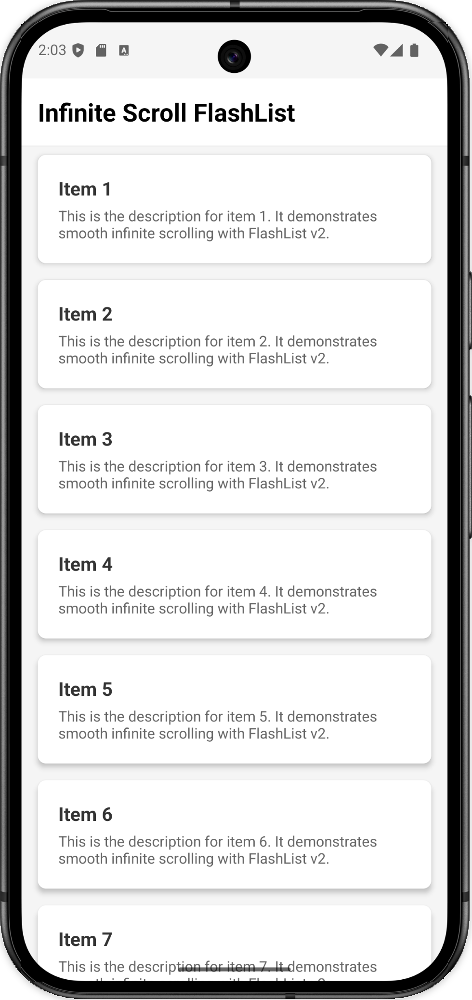

# Infinite Scroll FlashList



A high-performance, type-safe infinite scrolling (pagination) implementation using Shopify's `@shopify/flash-list`.

## Key Features

- **FlashList Integration**: Leverages `@shopify/flash-list` for superior performance and memory management over standard `FlatList`.
- **Generic Implementation**: Fully type-safe components and hooks that work with any data type.
- **Compound Component Pattern**: Easily customize loading indicators and empty states using a clean, declarative API.
- **Custom Hook**: Centralized logic for managing pagination state (loading, error, hasMore, page tracking).
- **Type Safety**: No `any` or `unknown` types; strictly typed generics for better developer experience.

## Project Structure

```text
src/
├── components/
│   ├── InfiniteScrollFlashList.tsx   # Main component (Compound Pattern)
│   ├── withInfiniteScroll.tsx        # Generic logic wrapper
│   └── InfiniteScrollFlashList.styles.ts
├── hooks/
│   └── useInfiniteScroll.ts           # Logic for pagination state
├── screens/
│   ├── ListScreen.tsx                # Example usage screen
│   └── ListScreen.styles.ts
└── types/
    └── infinite-scroll.types.ts       # Shared TypeScript definitions
```

## How It Works

### 1. Data Layer (`useInfiniteScroll`)
The `useInfiniteScroll` hook manages the pagination lifecycle. It takes a `fetchPage` function and returns the current `data`, loading states, and a `loadMore` callback.

```typescript
const { data, isLoading, isLoadingMore, hasMore, loadMore } = useInfiniteScroll({
  fetchPage: async (page) => {
    const response = await api.get(`/items?page=${page}`);
    return {
      items: response.data.items,
      hasMore: response.data.currentPage < response.data.totalPages,
    };
  },
});
```

### 2. UI Layer (`InfiniteScrollFlashList`)
The UI component wraps `FlashList` and injects pagination logic via an internal `InfiniteScrollWrapper`.

```tsx
<InfiniteScrollFlashList<Item>
  data={data}
  renderItem={renderItem}
  onLoadMore={loadMore}
  isLoadingMore={isLoadingMore}
  hasMore={hasMore}
/>
```

### 3. Customization (Compound Component Pattern)
You can provide custom UI for the loading indicator (footer) and empty states using attached sub-components.

```tsx
<InfiniteScrollFlashList.LoadingIndicator>
  <MyCustomSpinner />
</InfiniteScrollFlashList.LoadingIndicator>

<InfiniteScrollFlashList.EmptyState>
  <View><Text>No data available</Text></View>
</InfiniteScrollFlashList.EmptyState>
```

## Implementation Details

### Performance
- **FlashList**: Uses cell recycling to handle thousands of items with minimal memory footprint.
- **Callback Memoization**: All scroll handlers and render functions are memoized with `useCallback` to prevent unnecessary re-renders.
- **Off-thread Work**: Designed to keep the JS thread free for smooth scrolling at 60 FPS.

### Type Safety
The implementation uses TypeScript generics (`<T>`) throughout the entire stack, from the fetch function to the `renderItem` prop, ensuring that your data types are correctly inferred and validated at every step.

## Getting Started

1. Install dependencies:
   ```bash
   npm install @shopify/flash-list react-native-safe-area-context
   ```
2. Define your data type and fetch function.
3. Use the `useInfiniteScroll` hook in your screen.
4. Render the `InfiniteScrollFlashList`.
