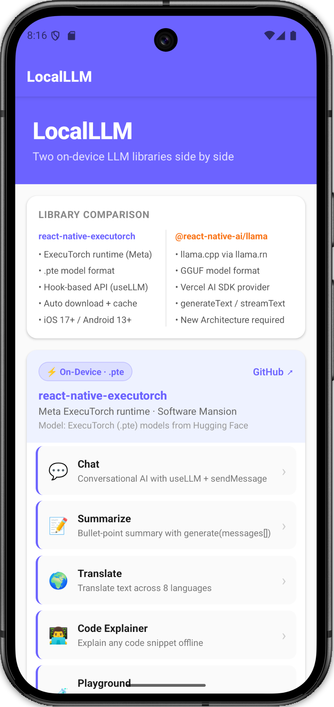
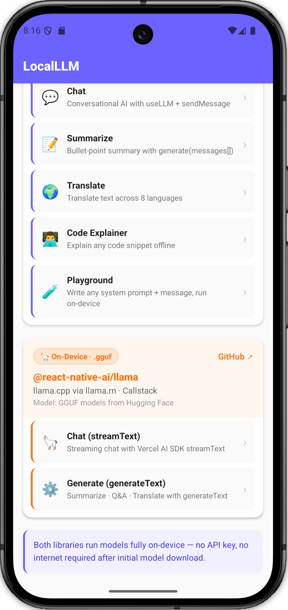
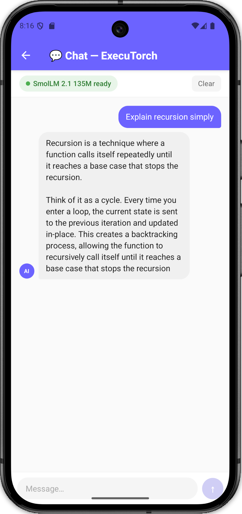
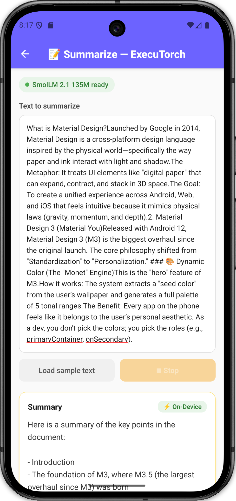
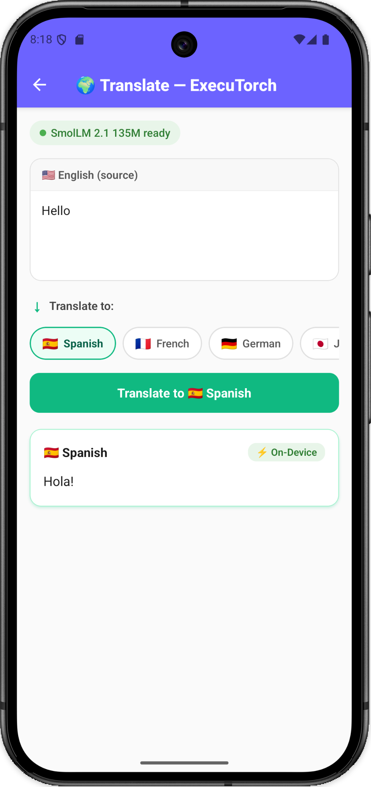
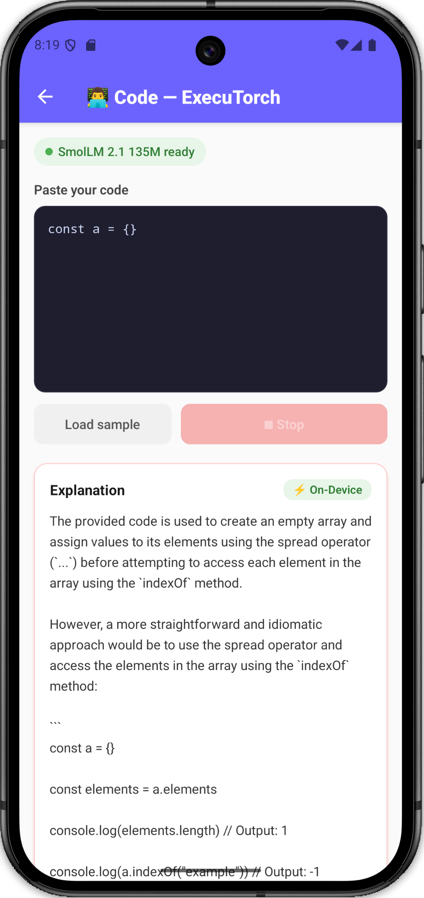
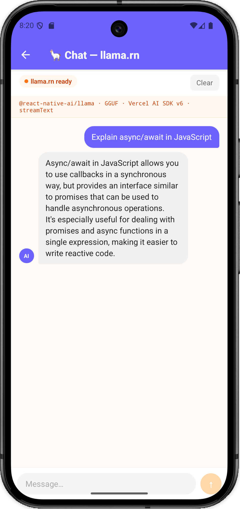
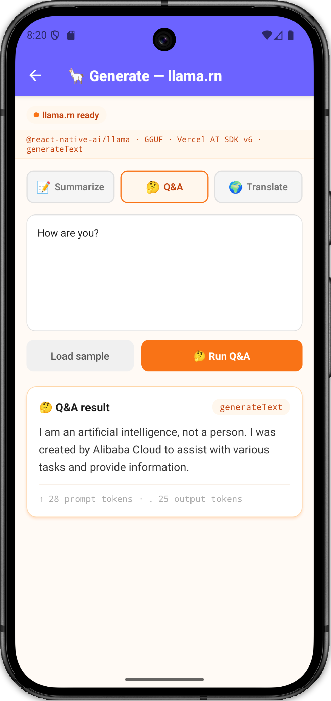
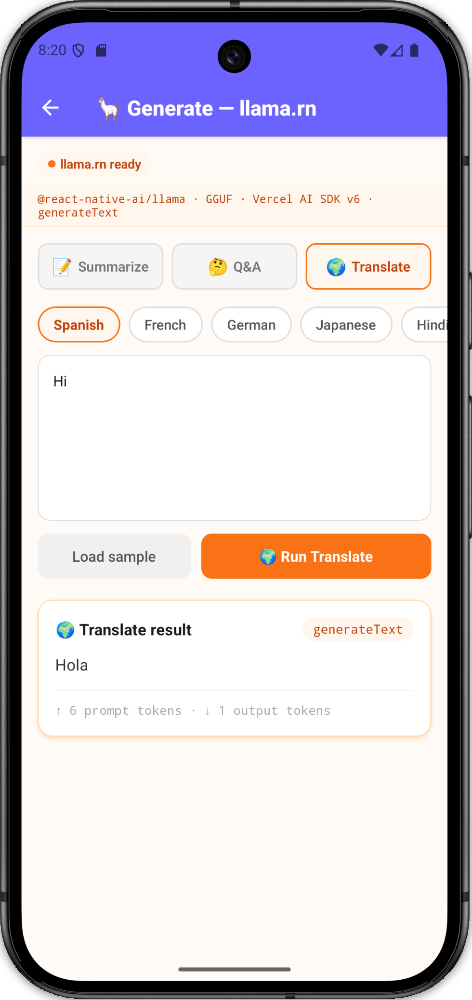

# LocalLLM — React Native On-Device AI

A React Native learning project that runs two on-device LLM libraries **side by side** so you can compare their APIs, model formats, and developer experience in a single app.

> Everything runs **fully on-device**. No API key. No server. No internet required after the first model download.

---

## Previews

<p align="center">
  
  
  
</p>
<p align="center">
  
  
  
</p>
<p align="center">
  
  
  
</p>

---

## Libraries

|                        | `react-native-executorch`                       | `@react-native-ai/llama`                      |
| ---------------------- | ----------------------------------------------- | --------------------------------------------- |
| **By**                 | Software Mansion                                | Callstack                                     |
| **Runtime**            | Meta ExecuTorch                                 | llama.cpp via `llama.rn`                      |
| **Model format**       | `.pte` (ExecuTorch export)                      | `.gguf` (llama.cpp quantized)                 |
| **API style**          | React hook — `useLLM`                           | Vercel AI SDK — `generateText` / `streamText` |
| **Streaming**          | `llm.response` state updates per token          | `textStream` async iterable                   |
| **Stop generation**    | `llm.interrupt()`                               | `AbortController.abort()`                     |
| **History management** | Automatic inside the hook                       | You own the `messages[]` array                |
| **Model source**       | Pre-exported by Software Mansion (Hugging Face) | Any GGUF on Hugging Face                      |
| **iOS minimum**        | 17.0+                                           | 15.1+                                         |
| **Android minimum**    | API 26+ (33 recommended)                        | API 24+                                       |
| **New Architecture**   | Required                                        | Required                                      |

---

## Screens

### react-native-executorch (5 screens)

| Screen             | What it demonstrates                                                                               |
| ------------------ | -------------------------------------------------------------------------------------------------- |
| **Chat**           | `useLLM` + `sendMessage()` — hook manages full conversation history automatically                  |
| **Summarize**      | `useLLM` + `generate(messages[])` — one-shot bullet-point summary                                  |
| **Translate**      | `generate()` with a target-language prompt — 8 languages via a chip picker                         |
| **Code Explainer** | `generate()` with a code-focused system prompt — runs 100% offline                                 |
| **Playground**     | Editable system prompt + user message, `generate()` — for prompt engineering without history state |

### @react-native-ai/llama — Callstack (2 screens)

| Screen             | What it demonstrates                                                                                                               |
| ------------------ | ---------------------------------------------------------------------------------------------------------------------------------- |
| **Llama Chat**     | `streamText` from Vercel AI SDK — tokens stream via `for await...of result.textStream` with `AbortController` cancel               |
| **Llama Generate** | `generateText` from Vercel AI SDK — full response + `usage.inputTokens` / `usage.outputTokens`; tabs for Summarize, Q&A, Translate |

---

## System Prompts

These are the system prompts used to shape the AI's behavior across different tasks:

| Task          | System Prompt                                                                                                                                                                                                |
| ------------- | ------------------------------------------------------------------------------------------------------------------------------------------------------------------------------------------------------------ |
| **Chat**      | `You are a helpful, concise AI assistant. Answer clearly and briefly.`                                                                                                                                       |
| **Summarize** | `You are a summarization expert. When given text, produce a concise summary using 3–5 bullet points. Start directly with the bullets — no preamble.`                                                          |
| **Translate** | `You are a professional translator. Translate the given text accurately and naturally into the target language specified by the user. Output only the translated text, nothing else.`                        |
| **Code**      | `You are a senior software engineer. When given code, explain: (1) what it does, (2) how it works step-by-step, (3) any notable patterns, and (4) potential issues. Be concise.`                             |
| **Cloud**     | `You are a helpful AI assistant. Respond clearly and helpfully to the user.`                                                                                                                                  |

---

## Project Structure

The project follows a **modular architecture** where each screen and component is isolated in its own directory with dedicated files for logic, styling, and constants.

```
LocalLLM/
├── index.js                            # App entry + Polyfills + initExecutorch()
├── App.tsx                             # Navigation root + LlamaProvider
├── src/
│   ├── context/
│   │   └── LlamaContext.tsx            # Llama model lifecycle shared across screens
│   ├── screens/
│   │   ├── Home/                       # Navigation hub with library comparison
│   │   │   ├── index.tsx               # View
│   │   │   ├── Home.styles.ts          # Styles
│   │   │   └── Home.constants.ts       # Constants
│   │   ├── Chat/                       # useLLM + sendMessage (multi-turn history)
│   │   │   ├── index.tsx               # View
│   │   │   ├── useChat.ts              # Logic (Custom Hook)
│   │   │   ├── Chat.styles.ts          # Styles
│   │   │   └── Chat.constants.ts       # Constants
│   │   └── ... (Summarize, Translate, CodeExplainer, Playground, LlamaChat, LlamaGenerate)
│   │
│   ├── components/
│   │   ├── MessageBubble/              # Shared chat bubble
│   │   ├── ModelLoader/                # ExecuTorch loading UI
│   │   └── LlamaModelLoader/           # Callstack loading UI
│   │
│   └── constants/                      # Global app-wide constants
```

---

## Getting Started

```bash
# 1. Install JS dependencies
npm install

# 2. iOS — install native pods
bundle install
bundle exec pod install

# 3. Run
npx react-native run-android
npx react-native run-ios
```

### Environment Setup (Polyfills)

To support the **Vercel AI SDK v6** and **Web Streams** in React Native's Hermes engine, several polyfills are initialized in `index.js`:
- `web-streams-polyfill`: Provides `ReadableStream` and `TransformStream`.
- `text-encoding`: Provides `TextEncoder` and `TextDecoder`.
- `structured-clone`: Provides `structuredClone`.
- `buffer` & `process`: Node.js compatibility globals.
- `react-native-get-random-values`: For secure `crypto` operations.

---

## Implementation Details

### ExecuTorch Initialization
ExecuTorch must be initialized with a resource fetcher before use. This is handled in `index.js`:
```ts
import { initExecutorch } from 'react-native-executorch';
import { BareResourceFetcher } from 'react-native-executorch-bare-resource-fetcher';

initExecutorch({ resourceFetcher: BareResourceFetcher });
```

### Custom Hooks
Every screen's business logic is separated from the view layer using a dedicated custom hook (e.g., `useChat.ts`). This hook manages the model lifecycle, such as **interrupting or aborting generation** when the component unmounts to prevent native crashes.

### Babel Configuration
The project uses the `@babel/plugin-transform-export-namespace-from` plugin to handle modern JavaScript syntax (like `export * as namespace`) used in `zod` and `ai` packages.

---

## Packages Summary

### `react-native-executorch` — `^0.8.1`
**By:** Software Mansion · [GitHub](https://github.com/software-mansion/react-native-executorch)
Runs quantized LLMs using Meta's ExecuTorch. It manages model download, local caching, and token streaming. This project uses the `BareResourceFetcher` for bare React Native support.

### `@react-native-ai/llama` — `^0.12.0`
**By:** Callstack · [GitHub](https://github.com/callstackincubator/ai)
A bridge between `llama.rn` (llama.cpp) and the Vercel AI SDK. It allows local GGUF models to be used with the universal `generateText` and `streamText` APIs.

---

## Common Commands

```bash
npx react-native start --reset-cache   # start Metro bundler
npx react-native run-android           # build + run on Android
npx tsc --noEmit                       # TypeScript type-check
npx eslint .                           # Linting
```
