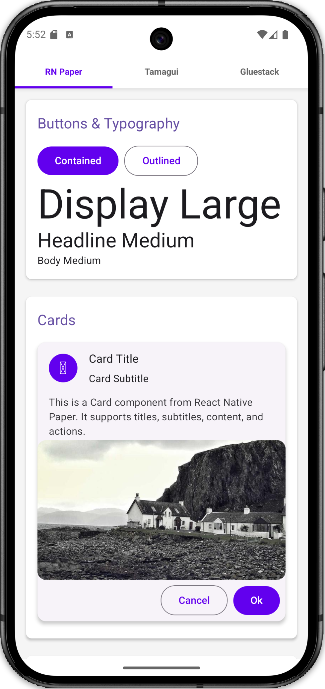
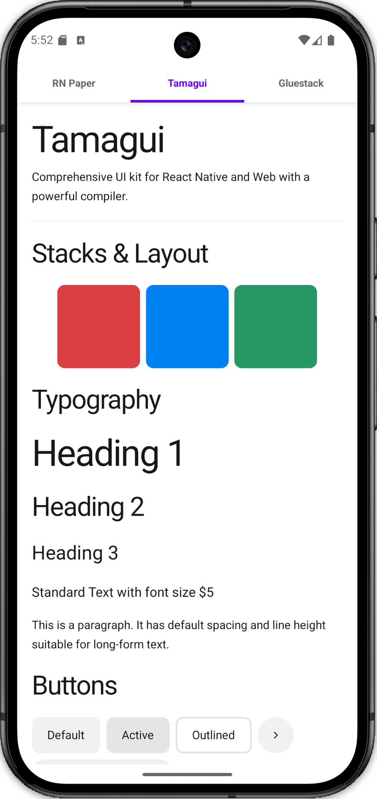
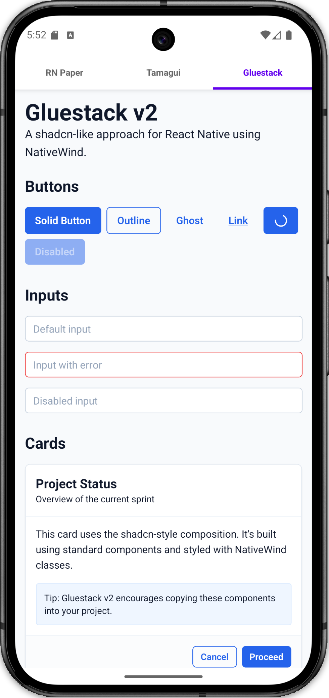

# React Native UI Libraries Showcase

A comprehensive guide and demonstration of the three major UI library approaches in React Native as of 2026. This project integrates Material Design, Compiler-first UI, and utility-first (Tailwind) approaches.

## Library to Package Mapping

### 1. React Native Paper (Material Design)
**Components:** See `src/paper/PaperUsage.tsx`

- `react-native-paper`: Core library components.
- `react-native-vector-icons`: Required for Material icons.

### 2. Tamagui (Compiler-First UI)
**Components:** See `src/tamagui/TamaguiUsage.tsx`

- `tamagui`: Core UI kit and styling engine (using **stable 1.144.4**).
- `@tamagui/config`: Configuration presets (using stable **v3** presets).
- `@tamagui/lucide-icons`: Lucide icon set optimized for Tamagui.
- `react-native-svg`: Required peer dependency for SVG icons.
- `@tamagui/babel-plugin`: (Dev) Optimizing compiler for zero-runtime styles.

### 3. Gluestack v2 (shadcn-like / NativeWind)
**Components:** See `src/gluestack/GluestackUsage.tsx` and `src/components/ui/`

- `nativewind`: Tailwind CSS for React Native.
- `tailwindcss`: Core Tailwind engine (using **v3** for NativeWind v4 compatibility).
- `@gluestack-ui/nativewind`: High-level components and logic.

### 4. Supporting Infrastructure
- `react-native-tab-view`: Main navigation between the libraries.
- `react-native-pager-view`: Required for high-performance tab transitions.
- `react-native-reanimated`: Core animation engine (using **v4** features).
- `react-native-worklets-core`: Required for Reanimated worklets.
- `react-native-gesture-handler`: Native gesture handling.

## Setup & Configuration

### Configuration Files
- `babel.config.js`: Integrated Tamagui, NativeWind, and Reanimated plugins.
- `tamagui.config.ts`: Core Tamagui tokens and themes using stable presets.
- `tailwind.config.js`: NativeWind content scanning paths and `nativewind/preset`.
- `metro.config.js`: NativeWind Metro transformer setup.
- `global.css`: Tailwind directives.

## Learning Path
1. **Material Design:** Start with `RN Paper` if you want a quick, standard look.
2. **Performance & Cross-Platform:** Use `Tamagui` for large-scale, performance-critical apps.
3. **Modern Web-Like Workflow:** Use `Gluestack v2` with NativeWind if you prefer Tailwind CSS and full control over component code.
