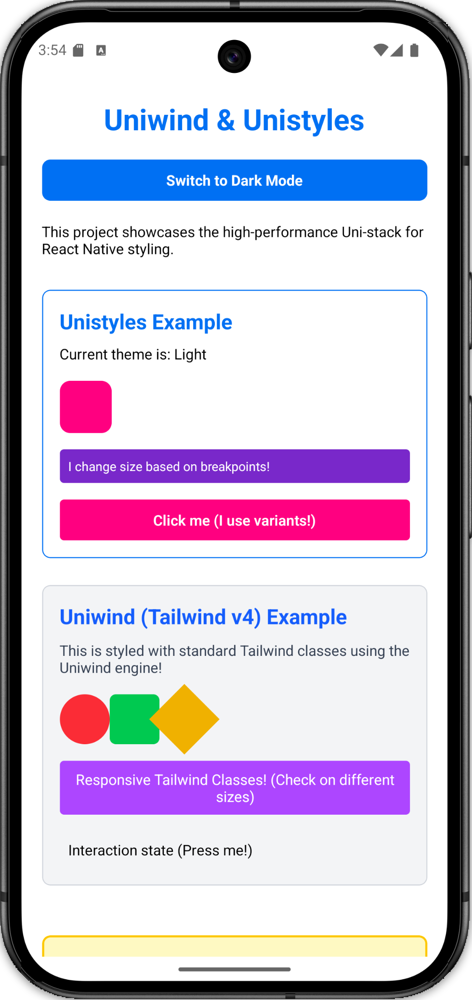
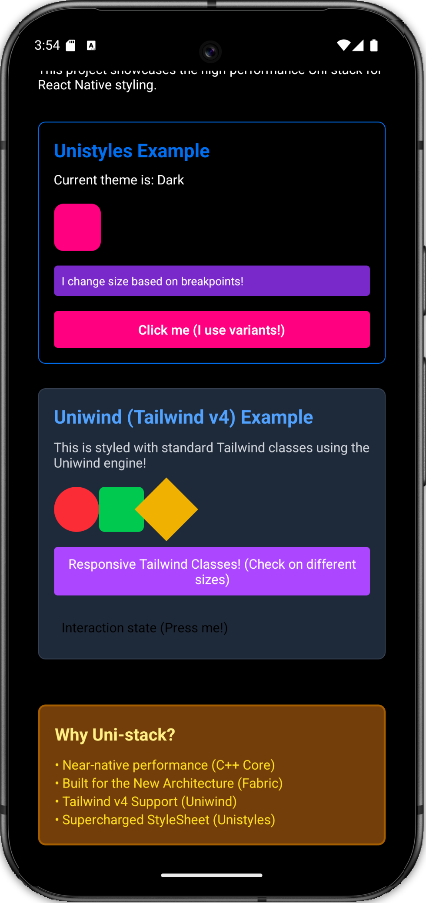

# Uni-stack: High-Performance React Native Styling (v3)

This project is a production-ready reference for the **Uni-stack**—the most advanced and performant styling solution for React Native. It combines **Unistyles v3** and **Uniwind (Tailwind v4)**, both built on a high-performance **C++ engine** optimized for the **New Architecture (Fabric)**.

## 📱 Previews

<p align="center">
  
  
</p>

---

## 🚀 The Uni-stack Philosophy
... rest of the file ...

The Uni-stack moves styling logic out of the JavaScript thread and into the **C++ layer**. This ensures that complex operations like theme switching, breakpoint calculations, and media queries happen at native speeds, providing **Zero Re-renders** and **Near-native performance**.

### 1. Unistyles v3 (The Foundation)
Unistyles v3 is a "StyleSheet on steroids." It replaces the standard `StyleSheet` with a powerful, type-safe engine.

- **C++ Engine:** Style calculations are offloaded to C++ via JSI/Nitro Modules.
- **StyleSheet.configure:** Centralized configuration for themes and breakpoints.
- **StyleSheet.create:** Supports dynamic functions, breakpoints, and variants.
- **useUnistyles Hook:** Subscribes components to theme and runtime changes.
- **UnistylesRuntime:** A global object for programmatic control (e.g., `UnistylesRuntime.setTheme('dark')`). *Note: In v3, you must disable `adaptiveThemes` before manually setting a theme.*

### 2. Uniwind (Tailwind v4)
Uniwind brings **Tailwind CSS v4** to React Native. It uses the same C++ engine as Unistyles, making it significantly faster than other Tailwind-in-JS libraries.

- **Tailwind v4 Power:** Supports modern Tailwind features and the new CSS-first configuration.
- **Utility-First:** Rapid UI development using standard `className` strings.
- **Optimized Parser:** Built-in C++ parser handles class resolution with minimal overhead.

---

## 📱 Understanding Breakpoints

Breakpoints allow your UI to respond to different screen sizes. In the Uni-stack, breakpoints are calculated **natively** in C++.

### Default Breakpoints in this Project
We use a standard set of breakpoints defined in `src/unistyles.ts`:

| Key | Value (px) | Device Target |
| :--- | :--- | :--- |
| `xs` | 0 | Small Phones |
| `sm` | 576 | Large Phones |
| `md` | 768 | Tablets (Portrait) |
| `lg` | 992 | Tablets (Landscape) |
| `xl` | 1200 | Large Tablets / Desktop |
| `superLarge` | 2000 | Ultra-wide Screens |

### Usage in Unistyles
You can define responsive values directly in your styles:
```tsx
const styles = StyleSheet.create((theme) => ({
  container: {
    width: {
      xs: '100%',
      md: '50%', // Automatically switches at 768px
    },
    padding: theme.spacing.md,
  },
}));
```

### Usage in Uniwind
Use Tailwind's responsive prefixes:
```tsx
<View className="w-full md:w-1/2 p-4" />
```

---

## 🎨 Variants & Compound Styles

Unistyles v3 introduces a powerful **Variants** system, allowing you to create complex, reusable components with multiple states.

### Defining Variants
```tsx
const styles = StyleSheet.create((theme) => ({
  button: {
    borderRadius: 8,
    variants: {
      color: {
        primary: { backgroundColor: theme.colors.primary },
        secondary: { backgroundColor: theme.colors.secondary },
      },
      size: {
        small: { padding: 4 },
        medium: { padding: 10 },
      },
    },
  },
}));
```

### Applying Variants
Variants are applied inside your component using the `useVariants` method:
```tsx
export const MyButton = () => {
  styles.useVariants({
    color: 'primary',
    size: 'medium',
  });

  return <Pressable style={styles.button} />;
};
```

---

## 🛠️ Project Architecture

### `src/unistyles.ts`
The heartbeat of the project. It uses `StyleSheet.configure` to register themes and breakpoints and extends the Global TypeScript interfaces for full autocompletion.

### `src/theme.ts`
Contains the `lightTheme` and `darkTheme` definitions. All colors, spacing, and typography constants are defined here.

### `App.styles.ts`
Following the **Modular Pattern**, all styles for `App.tsx` are extracted here to keep the component logic clean and adhere to ESLint "no-inline-styles" rules.

### `src/components/`
- **`UnistylesComponent.tsx`**: Demonstrates advanced Unistyles features like variants, breakpoints, and dynamic theme access.
- **`UniwindComponent.tsx`**: Showcases Tailwind v4 utility classes, responsive prefixes, and interaction states (`active:`, `group-active:`).

---

## 🆚 Comparison: Why the Uni-stack?

| Feature | Standard StyleSheet | NativeWind (v4) | Uni-stack (v3) |
| :--- | :--- | :--- | :--- |
| **Speed** | Fast | Moderate | **Ultra Fast (C++)** |
| **Themes** | Manual Context | Good | **Native/Automatic** |
| **Breakpoints** | Manual Logic | Class-based | **Integrated (C++)** |
| **Type Safety** | Basic | Limited | **Full (Strict TS)** |
| **Fabric Ready** | Yes | Yes | **Optimized for Fabric** |

---

## 📖 Best Practices Used Here

1.  **Strict Typing**: No `any` types. Everything is derived from the theme and breakpoint definitions.
2.  **Separate Style Files**: No inline styles in components. This improves readability and maintainability.
3.  **Adaptive Themes**: Enabled by default. Switching system theme automatically updates the UI without JS re-renders.
4.  **Compound Component Pattern**: Used for clean, reusable UI elements.
5.  **Safe Areas**: Always handled via `react-native-safe-area-context`.
