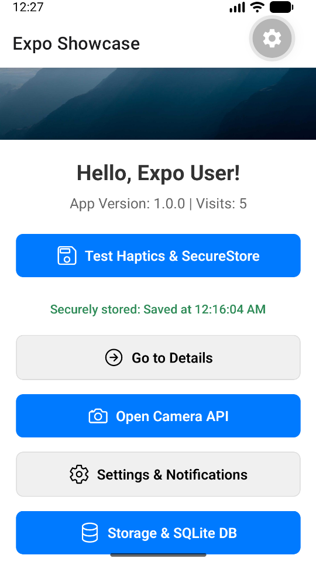
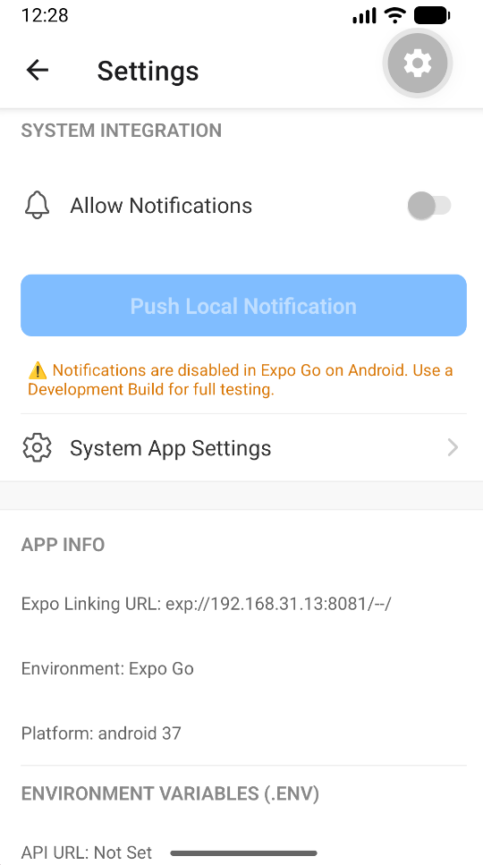
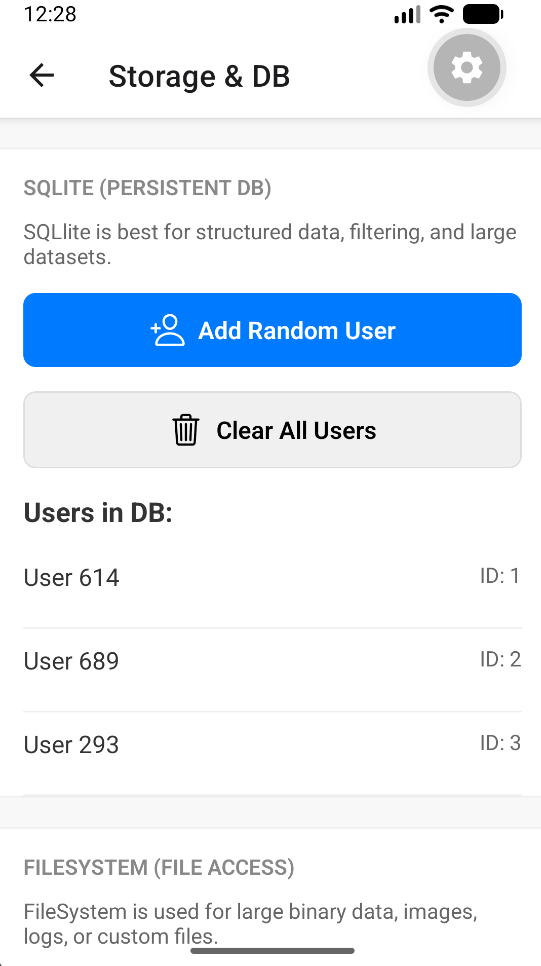

# 🚀 Expo Showcase: Production-Grade Reference (2026)

Welcome to the **Expo Showcase**! This project is a comprehensive, production-grade React Native application built with the latest **Expo SDK** and **New Architecture** (TurboModules & JSI). It serves as a living laboratory for modern Expo development, demonstrating every major feature in a modular, maintainable structure.

## 🌟 Key Features

### 1. Advanced Navigation & Routing
- **`expo-router`**: Fully file-based, declarative routing.
- **Dynamic Links**: Configured app scheme (`expo-app://`) for universal deep linking.
- **Native Stack**: Optimized screen transitions and header management.

### 2. High-Performance State & Storage
- **Zustand + MMKV**: Global state management using the fastest C++ based key-value store.
- **Fail-Safe Persistence**: Automatic fallback to `AsyncStorage` when running in Expo Go.
- **`expo-sqlite`**: Full relational database support for structured data queries.
- **`expo-secure-store`**: Encrypted OS-level storage (Keychain/Keystore) for sensitive tokens.
- **`expo-file-system`**: Direct disk access for binary data and large logs (v18+ Nitro API).

### 3. Native API Integration
- **`expo-camera`**: Modern camera interface with granular permission handling.
- **`expo-notifications`**: Production-grade local push notification scheduling and handlers.
- **`expo-haptics`**: Tactile feedback for an improved user experience.
- **`expo-sharing` & `expo-media-library`**: Full asset lifecycle from capture to gallery to sharing.

### 4. Optimized UI & UX
- **`expo-image`**: Performant image rendering with caching and **Blurhash** loading states.
- **`expo-font` & `expo-splash-screen`**: Total control over the app's boot sequence and typography.
- **`expo-system-ui`**: Direct control over native root view styling.
- **`@expo/vector-icons`**: Standardized iconography for cross-platform consistency.
- **Environment Variables**: Native `.env` support using the `EXPO_PUBLIC_` prefix.

---

## 📱 App Previews

Below are the core screens demonstrating the Expo SDK features. 
*(Note: Add your screenshots to the `preview/` folder to see them here!)*

| Home Screen | Camera API |
|:---:|:---:|
|  |  |
| **Persistence & Haptics** | **Native Capture** |

| SQLite & Storage | Settings |
|:---:|:---:|
|  |  |
| **Relational Data** | **Notifications & Env** |

---

## 📦 Package Glossary & Purpose

This project utilizes a curated set of Expo and React Native packages to provide a complete production-grade experience. Below is the breakdown of each package and its role in the app:

### Core & Navigation
- **`expo`**: The backbone of the project, providing the SDK, native modules, and build tools.
- **`expo-router`**: Handles file-based routing. It maps your `app/` directory directly to the navigation stack.
- **`@expo/metro-config`**: Customizes the Metro Bundler to support advanced features like SVG transforms or custom file extensions.

### Storage & Persistence
- **`@react-native-async-storage/async-storage`**: Used as a stable fallback for global state persistence when running in Expo Go.
- **`expo-sqlite`**: A full relational database used for structured data, demonstrated in the `database` screen.
- **`expo-secure-store`**: Encrypted storage for sensitive data like auth tokens.
- **`expo-file-system`**: Provides access to the device's storage for raw files and binary data.

### Native Device APIs
- **`expo-camera`**: Provides the UI and logic for capturing photos and videos.
- **`expo-notifications`**: Manages local and push notifications (wrapped in lazy-loading for Expo Go compatibility).
- **`expo-media-library`**: Allows the app to save and retrieve assets from the user's photo gallery.
- **`expo-haptics`**: Triggers native tactile feedback (vibrations) to improve user interaction feel.
- **`expo-sharing`**: Opens the native OS share sheet to send files or text to other apps.
- **`expo-constants`**: Accesses system-level info like app version, device ID, and environment type.
- **`expo-linking`**: Handles deep linking into the app and opening external system settings.

### UI & UX Enhancement
- **`expo-image`**: A high-performance replacement for the standard Image component, featuring caching and Blurhash support.
- **`expo-font`**: Asynchronously loads custom typography (like the included SpaceMono font).
- **`expo-splash-screen`**: Controls the visibility of the initial loading screen while the app boots up.
- **`expo-status-bar`**: Manages the styling of the OS status bar (light/dark/auto).
- **`expo-system-ui`**: Customizes native UI elements, such as the root view's background color.
- **`@expo/vector-icons`**: A library of popular icon sets (Ionicons, Material, etc.) bundled for Expo.

---

## 🏗️ Architecture

The app follows a modular, atomic design pattern to ensure scalability:

```text
expo/
├── app/                 # 📂 Routing Layer (Thin screens)
│   ├── _layout.tsx      # Global Stack configuration
│   ├── index.tsx        # Home screen (uses modular components)
│   ├── camera.tsx       # Camera API implementation
│   ├── database.tsx     # SQLite & FileSystem implementation
│   └── settings.tsx     # Notifications & System integration
└── src/                 # 📂 Application Core (Logic & UI)
    ├── components/      # Reusable UI (Atomic components)
    ├── constants/       # App-wide theme & configurations (Colors)
    ├── hooks/           # Custom Logic (Encapsulated side-effects)
    ├── store/           # Persistence (Zustand + MMKV)
    └── styles/          # Separated StyleSheets (*.styles.ts)
```

---

## 🚀 Getting Started

### Prerequisites
- [Node.js](https://nodejs.org/) (LTS)
- [Expo Go](https://expo.dev/go) (on your iOS/Android device) or a Development Build environment.

### Installation
```bash
cd expo
npm install
```

### Running the App
```bash
npm start
```

-   **Press `w`**: Open in a web browser.
-   **Scan QR**: Open in **Expo Go** on your physical device.

---

## 🧪 Compatibility Notes

This project is built to be "Universal" and "Build-Aware":

- **Expo Go Support**: Features like MMKV (NitroModules) and high-level Notifications are wrapped in safety checks. If a feature is unavailable in Expo Go, the app will automatically fall back to a compatible alternative (like `AsyncStorage`) or provide a helpful alert.
- **Development Builds**: For full performance (C++ MMKV speed) and native-only features, use `npx expo prebuild`.

---

## 📚 Deep Dive
For a technical explanation of JSI, TurboModules, and the architectural decisions made in this project, please read:
👉 **[EXPO_GUIDE.md](./EXPO_GUIDE.md)**

---
*Created for the Gemini CLI React Native Learning Series (March 2026).*
